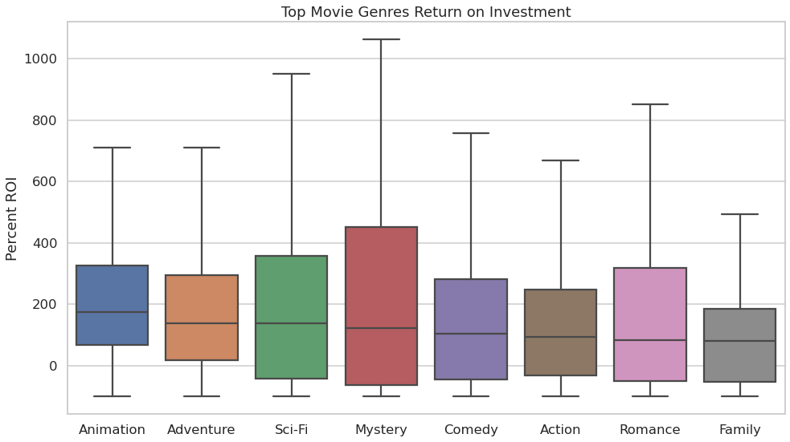
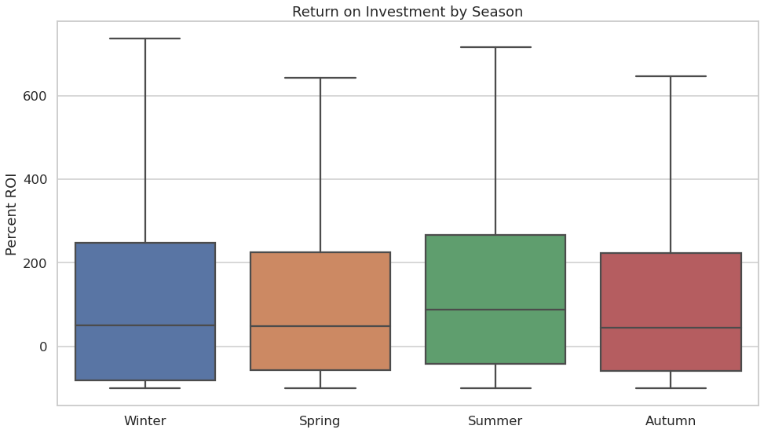
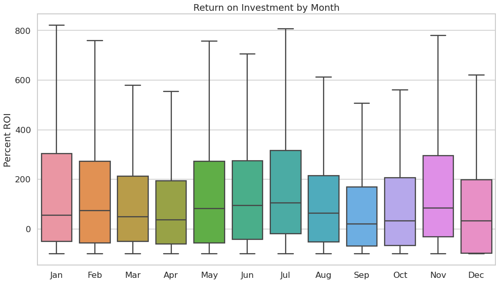
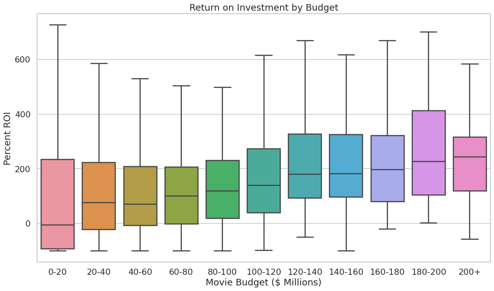
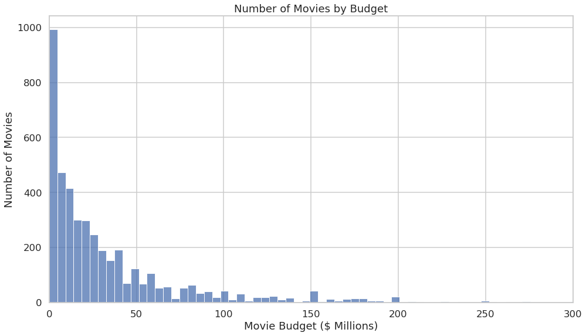

# Movie Industry Analysis Project

Author: Jason Lombino

## Overview

Microsoft has decided to open a movie studio, but does not know anything about creating movies. They have tasked me with determining what factors play a role in the financial success of a movie. In order to do this, I analyzed 20 years of box office data for insight into what successful movies have in common. I recommend releasing an Animation, Adventure, or Sci-Fi with a budget between $120 million and $200 million to maximize return on investment. In addition, I recommend releasing the movie during the summer. Microsoft's new movie studio can follow these recommendations to get the most out of their first movie.

##  Business Problem


I have been tasked with using the provided datasets to create three concrete business recommendations for Microsoft. I answer the following three questions in this analysis:

* What movie genres have the highest return on investment?
* When is the best time of year to release a movie?
* What budget should the movie have?

## Data

In the folder `zippedData` are movie datasets from:

### Used in my analysis:
* [IMDB](https://www.imdb.com/)
* [The Numbers](https://www.the-numbers.com/)

### Provided but not used in my analysis:
* [Box Office Mojo](https://www.boxofficemojo.com/)
* [Rotten Tomatoes](https://www.rottentomatoes.com/)
* [TheMovieDB](https://www.themoviedb.org/)

## Methods

I imported the data from IMDB and The Numbers and joined the datasets together on the movie title. I dropped duplicate rows, and any rows from the IMDB dataset for which financial information was not available. I engineered some useful features, most notably total profit and return on investment, for each movie. Finally, I used visualizations and descriptive statistics to analyze each of the three factors I previously identified to find trends and provide recommendations for my business questions.

## Results

I first looked at return on investment broken down by movie genre. The top three genres were Animation, Adventure, and Sci-Fi. Genre was a sigificant factor in performance because the median Animation movie performed over 3 times as well as the median movie overall.
 


I then looked at return on investment broken down by the season during which the movie was released. Summer proved to be the best season to release a movie. The median movie released during the summer performed about 60% better than the median movie overall.



I then further broke down the release time into months. July proved to be the best month to release a movie.



The chart below shows the return on investment for movies that fall into different budget categories. It initially appears that movies with a higher budget tend to perform better. This is not necessarily true, however because the sample size gets very small at high budgets leading to less confidence in those results.



You can see in this graph that the sample size really starts to fall off after about $ 200 million dollars. For this reason, I can not recommend Microsoft use a budget higher than this.




## Conclusions

I suggest that microsoft follow these guidelines when releasing their first movie:

* Release an Animation, Adventure, or Sci-Fi movie.
* Release the movie during the summer. (July if possible)
* Provide a budget of $120 million to $200 million for the movie.

## Future Considerations

In the future, It would be worth looking further into the following:

* Specific actors, directors, and writers to hire for the movie.
* How the factors identified above will change in foreign and future markets.

## For More Information

Please review my [Jupyter Notebook](https://github.com/jlombino/dsc-phase-1-project/blob/main/Jason's%20Work.ipynb) and [Presentation](https://github.com/jlombino/dsc-phase-1-project/blob/main/Slides.pdf) to see my full analysis.

## Repository Information
```
├── README.md                        <- The top-level README you are currently reading
├── Jason's Work.ipynb               <- Jupyter notebook with my full analysis
├── slides.pdf                       <- PDF version of project presentation
├── Description.md                   <- Project description and requirements provided by upstream
├── zippedData                       <- Project data provided by upstream
└── Images                           <- Graphs generated from code
```
